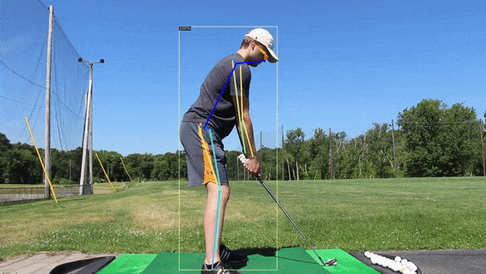
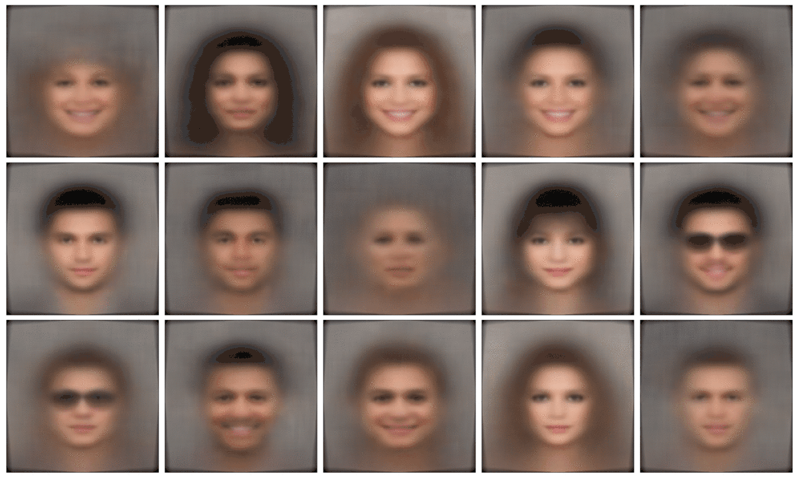

# [Forthcoming] Golf Swing Analysis with Pose Estimation

# [Generative Modeling of Faces with a ResNet VAE](https://github.com/dylanrandle/deepgen)

# [Microbiome Modeling with Causal-LSTMs](https://github.com/dylanrandle/microbiome)

# [Twitter Troll Detection](https://dylanrandle.github.io/troll_classification)

# [Automatic Differentiation](https://github.com/dylanrandle/autograd)

<!-- # [Interpretable Machine Learning](https://github.com/dylanrandle/pynterp) -->
<!-- # [Tensorflow Training on a Spark Cluster with AWS EMR](https://github.com/dylanrandle/spark-tensorflow) -->
<!-- # [Bayesian GANs: A Paper Review](bayesgan/bayesgan.html) -->
<!-- # [Autonomous Vehicles: A Critical Analysis](safe_avs/safe_avs.html) -->
<!-- # [ComputeFest 2020 Workshop: Notebook to Cloud](https://colab.research.google.com/drive/1HUxNsHqqTZ1FRuveu6SS6gr6lCVe6QqO) -->
