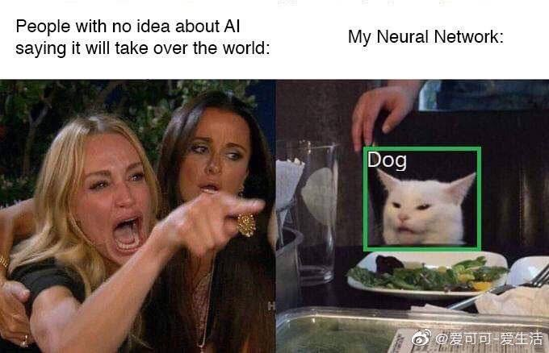

# Dylan's Blog

*Disclaimer: The views and opinions expressed in this blog are those of the authors and are not endorsed by any organization or entity.*

<!-- ## Navigation -->
{:.no_toc}
*  
{: toc}

## The AI Anti-Hype

November 26, 2019

*Dylan Randle*

The inspiration for writing this article is the following image:

With the recent (remarkable) successes in machine learning (particularly in *deep learning* with neural networks),
many otherwise intelligent folks have posited highly questionable theories about
runaway AI super-intelligence. The problem with listening to these views is that these people *have no idea what
they're talking about*.

The development of "AI" has always been a product of *human ingenuity* and nothing else. There is
this idea that "we don't know what neural networks are doing" and "they're learning" and "what if they keep learning at
this exponential rate and overtake our own intelligence"? But this is completely and utterly misguided.

Firstly, the notion that we don't know what neural nets are doing is false. While we may not be able to *explain* or *understand* precisely the mechanisms by which neural networks make their predictions, we have very clear ideas and evidence about what is happening. Neural networks are simply a convenient substrate over which to optimize parameters for machine learning tasks. They are flexible, and our optimization procedures can utilize this to great effect.

Further, the personification of "learning" is taken too literally. This is just a convenient term to describe the process
of optimizing parametric models. How we judge learning is a whole other story. Generally we talk about generalizability to a test set, but this is prone to many well-understood problems (i.e. covariate shift, the scenario in which new real-world data is different from the distribution of data that generated the training and test sets). It is not something that can "run away" from us. This is something that AI practitioners spend countless hours carefully tweaking to obtain the desired result. And it is not something that can be done mindlessly by a computer as it requires an understanding of the real-world process that generated the data.

Now let's address the point of "overtaking" our own intelligence. After having spent the last few years immersed in the actual research being conducted in AI, this notion is particularly striking. The improvements we have been seeing in AI algorithms are
**a direct result of hard work, ingenuity and effort** by incredibly talented, creative, and intelligent researchers. Every algorithm ever created was created by a human. (And, by the way, we have tried to get "AI" to construct algorithms and they have so far been pitifully miserable at this task.) Research proceeds in ebs and flows with major breakthroughs peppered throughout. But what is the nature of these breakthroughs? Is it a computer which suddenly divines new methods which no human could have thought of? Absolutely not. It is the careful work of dedicated human researchers.

The engineering of AI will be furthered by passionate and energetic *humans*. We do not need to worry about runaway intelligent algorithms, because we are the builders that imbue computers with "intelligence". We *should* be careful about how we *use* these new powerful tools. But, at each step of the way, we can rest easy knowing that progress will be delivered by human ingenuity and not by some evil super-intelligence.

## Prediction vs Inference

September 6, 2019

*Dylan Randle*

Recently, in my role as Data Scientist at Amazon, I have been faced with one of the fundamental dichotomies of data science: the tradeoff between inference and prediction (aptly discussed in [this Harvard Data Science Review article](https://hdsr.mitpress.mit.edu/pub/a7gxkn0a)). The situation is best described through example: consider a computer vision system that predicts if an image contains a cat; in this setting, we would only care about the accuracy of our model and would not be focused on explaining why a prediction was made--either there's a cat or there isn't. In contrast, if we are fitting a model to predict an illness, for example, it would be paramount to understand why the model made a certain prediction. Not just for the peace-of-mind of the doctor and patient, but, even more fundamentally, for the development of science itself.

As the word "tradeoff" implies, it is unfortunately not often the case that we can "have our cake an eat it too", so to speak. In most cases, prediction and inference must be traded off for one another: adding more "inference" generally means we give up some predictive power if we hold the amount of computation constant. In this post, I want to explain why the framing of data science problems in terms of prediction and inference is a crucial step in designing and implementing any data science solution.

The prediction vs. inference question can be boiled down to the following two cases:
1. We want to predict *y* for some new, unseen *X*
2. We want to understand how *X* leads to *y* (the so-called "data generating process")

If the first case seems like the correct choice, then our problem is primarily one of prediction, and vice-versa for inference. Being clear about which question we are trying to answer will make our lives easier.

**A practical scenario**

Let's step back and understand, in concrete terms, how this might play out in practice. Suppose, for example, that we are approached by a shop owner who would like to "leverage his/her customer data to increase sales". This is typical of the questions encountered "in the wild": vague and underspecified. We must dive deeper to probe for the answer to the prediction/inference tradeoff.

In this case, we might ask the owner the following questions:
- "How important is it to understand which aspects of the data drive sales?"
- "Do you want to gain insights about your customer and convey these to your sales associates?"
- "Would you be willing to employ a system for predicting customer-by-customer shopping behavior?"

The answers to these questions provide meaningful insights. If they come back on the inference spectrum (i.e. "understanding is paramount to me, I am not comfortable with deploying a machine learning solution in my store"), we want to err on the side of **simple, interpretable models** and be very careful about:
1. Understanding the data we have been given
2. Cleaning and filtering it to obtain an appropriate sample
3. Dealing with multicollinearity, testing model assumptions, and crafting useful visualizations

On the other hand, a prediction-focused answer might sound something like "I could care less about why my customers buy something, I just want to know who is likely to buy and who is not!" In this example, we would need to dive deeper to brainstorm ways in which predictions could be used to facilitate the owner's goals of increasing sales. One potential idea could be to use this information to inform real-time decision making (e.g. whether to offer a customer a deal), but without any need to explain the decisions to a human. Here we should focus on the best possible **performance on the test set** and doggedly pursue the following steps:
1. Select data and generate training, testing and validation sets that is/are representative of the future (as far as we can tell)
2. Train and evaluate models in order of increasing complexity (don't worry about interpretability: tree ensembles & neural networks are fair game); inspect model training to balance under/over-fitting
3. Employ cross-validation to tune hyper-parameters (if computation is a bottleneck, focus on scalable methods for implementing this step, e.g. multi-GPU/distributed processing)

Each approach leads to vastly different workflows: in inference we place greater emphasis on understanding the data and carefully abiding by the assumptions of our model, while in prediction we focus on fitting the data extremely well and in a way that we are confident will generalize to future scenarios. Whatever the case, being clear-eyed about the ultimate focus of the problem will save much back-and-forth and streamline the process from conception to solution. Ultimately, data scientists are tasked with finding a sensible balance between prediction and inference that best suits the use-case and delivers the greatest value. I believe it is paramount to understand this tradeoff to become an effective data scientist.

## The "AI-Revolution"

July 4, 2019

*Dylan Randle*

I recently re-read an [article](https://hdsr.mitpress.mit.edu/pub/wot7mkc1) which I have become very fond of: "Artificial Intelligence: The Revolution Hasn't Happened Yet" by one of the most respected researchers in the world of computer science and statistics, Michael I. Jordan. The article is his take on the AI hype, and serves as an important framing of the new field of "data science" for all the researchers in the field.

The essence of Jordan's message is this: the current round of AI innovations are not intelligent. This is backed up by others who have claimed deep learning is merely "curve-fitting", albeit in high dimensional space. And it is true, our deep learning systems come nowhere close to having common-sense and higher-level reasoning capabilities akin to humans. These deep learning achievements (and they certainly are incredible achievements) amaze us with their shows of raw sensorimotor skills, yet they continue to lack true intelligence.

All the while, our world is swimming in data and is unable to leverage it to its full potential. The status quo is one in which patients are routinely misdiagnosed simply due to the improper application of rudimentary statistical analyses (Jordan gives the example of his child whose life would have been put at undue risk due to the application of a miscalibrated statistical test).

The point is this: don't become enthralled by the "AI" achievements we are seeing and place all our faith in them for solving our problems (did chemical engineers believe an AI god would design their chemical plants?). We need a principled approach to solving our problems, not some fantastical fiction about an omnipresent AI who will do our bidding.

We lack an ability to bring together disparate data across time and space and to make appropriate conclusions from it. We are behind in the pursuit of augmented intelligence, whereby data can assist humans in decision-making by strengthening our quantitative abilities (which turns out to be the place in which computers have us beat, for now). We should remain inspired and continue to drive the field of AI forward, but it is important not to lose sight of the bigger picture and, in doing so, forget there are many tangible issues *right now* (not just AI!) that require distributed systems, statistics, privacy, and machine learning solutions.

## My 10,000 Hours

July 4, 2019

*Dylan Randle*

Last night, I started reading Malcolm Gladwell's book, *Outliers*, and today I would like to write down my thoughts about it. In *Outliers*, Gladwell seeks to uncover the hidden alchemy of success and dispel the widespread myths surrounding it. He asserts that our common notion that success is achieved through some kind of utopian meritocratic process is patently false. In hockey, he explains, the vast majority of successful players share a single characteristic: their birthdate's proximity to January 1. Why is this? It's simple: hockey's age cutoff begins on January 1, and so players born closest to the cutoff will be the most mature in their cohort.

One would not, at first, imagine this to be a huge difference-maker. However, Gladwell is quick to point out that it serves to reinforce a self-fulfilling prophecy inherent in hockey's development model. When players are young, say below the age of eight, hockey players all play together. But at this young age, a few months of maturity can make a big difference, and so those players born close to January 1 tend to excel. This leads them to be selected for advanced training, the effect of which becomes compounded over many years, and voila: our best hockey players are overwhelmingly born from January-March.

So, Gladwell muses, perhaps success is not purely based on talent. Indeed, maybe our environment and the circumstances in which we grow up is a better predictor of how high up the ladder we will climb. Investigating this notion further, Gladwell turns to world-class musicians. Here he finds that the secret to utter mastery of an instrument lies in a seemingly arbitrary yet highly recurrent number: **10,000 hours** (of practice). It is this number that he finds cropping up everywhere he looks. Whether it be back with the hockey players or in his interviews with high performers across fields as diverse as music, software engineering, and management. Gladwell even posits that Mozart may have only produced his best works--works which truly deserve the "masterpiece" designation--after he had reached the 10,000 hour mark in his twenties.

This led me to think: "what are my 10,000 hours?" and what would I like to do with them? Throughout my childhood I focused on various pastimes. Early on, I played hockey and competed in alpine skiing races; in my teens I focused on academics and became interested in mathematics, physics, and economics; in my spare time I developed an enthusiasm for Rubik's cubes: either solving big ones (like the 7x7x7 or the 12-sided Megaminx), or solving them quickly (speedcubing, as it is known, e.g. solving a 3x3x3 in under 20 seconds); I even regularly played, and still play, the guitar. But upon reflection, I must conclude that it is mathematics, without a doubt, wherein lies my potential to reach the all-important 10,000 hour mark.

In high school I was in the advanced math class, a member of the math society, and wrote my high school thesis on a subject in mathematics; I had a tutor who would take me through advanced topics every week, and my innate passion for the subject has led me to pursue a master's in data science and to work on math-related subjects in my professional life. If we group together the disparate fields in which I have worked (mathematics, physics, operations research, data science), and place them all under the banner of mathematics, my rough accounting estimates I have spent between 8,000 and 10,000 hours in the practice of mathematics. I hope I am soon be due for my masterpiece!
