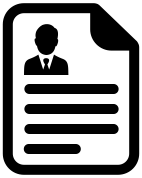

## Welcome to my website!

This is the personal website of Dylan Labatt Randle.

 
 

## Contents:
- ### [Research](research.html) and [applied projects](applied.html)
- ### [Resume](resume/resume.pdf), [GitHub](https://github.com/dylanrandle), and [LinkedIn](https://linkedin.com/in/dylanrandle/)
- ### [Blog](blog.html)

## Updates:
- ### (2020-07-21) My [paper](denn/deqgan.html) on unsupervised solutions to differential equations with generative adversarial networks has been published on [arXiv](https://arxiv.org/abs/2007.11133)!
- ### (2020-05-28) I [graduated](blog.html#graduation-from-harvard) from Harvard's MS in Data Science (and [made the news](https://www.bostonherald.com/2020/05/28/harvard-grads-celebrate-on-their-own/))!
