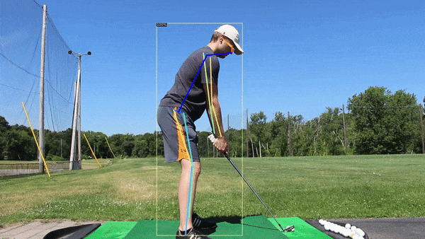
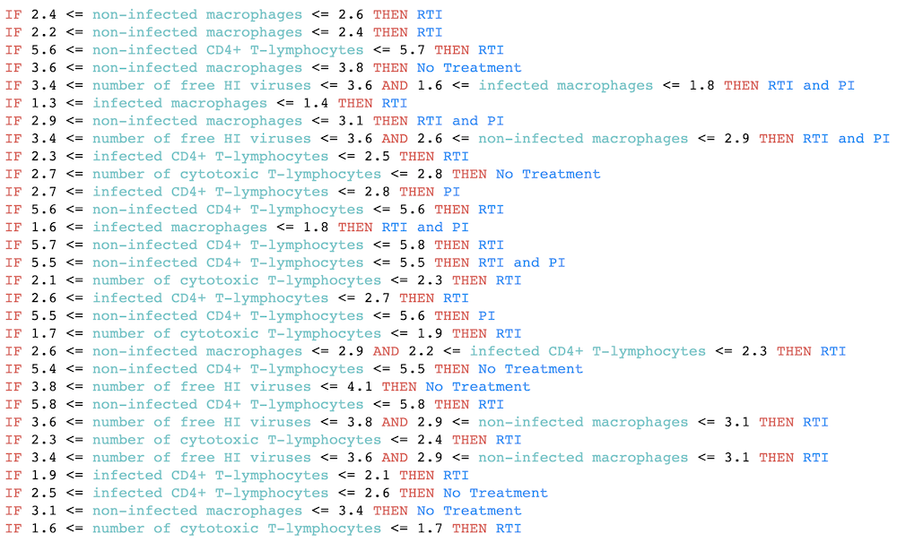
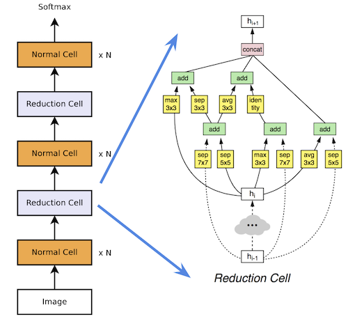
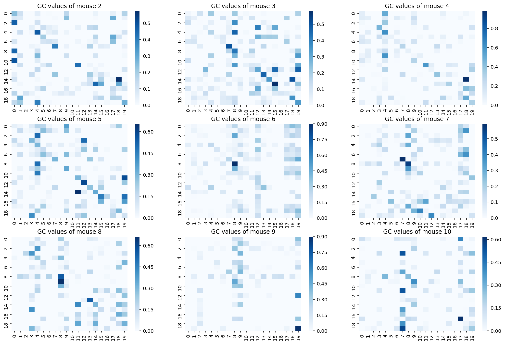
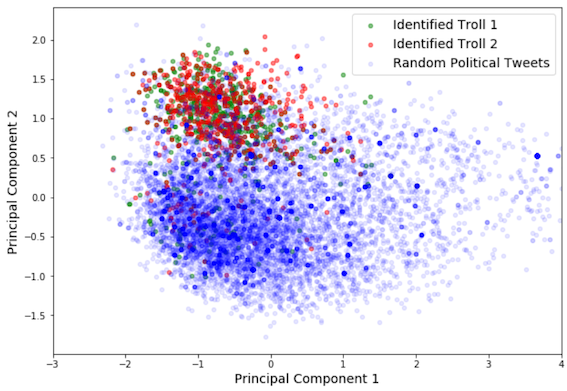

I am a passionate **data scientist** with a particular interest in **deep learning**. I have worked on NLP and CV problems as well as more exotic applications like solving differential equations and differentiable neural architecture search. I love reading papers and staying up to date on the latest techniques. My focus is on solving challenging **applied research** problems.

In my spare time, I enjoy skiing (both on water and snow), hiking, camping, golfing, playing the guitar, listening to music (country, folk, western, funk, hip-hop, electronic), and watching sports (hockey, football).

# Projects

## Analysis of Golf Swings with Computer Vision (In Progress)

## [Unsupervised Learning of Solutions to Differential Equations with Generative Adversarial Networks](projects/denn/deqgan.html)

## [Generating Faces with a ResNet VAE](https://github.com/dylanrandle/deepgen)

## [Learning Interpretable Decision Sets for Healthcare with Reinforcement Learning](projects/irl/irl.html)

## [Evaluating Differentiable Neural Architecture Search for Scientific Datasets](https://towardsdatascience.com/investigating-differentiable-neural-architecture-search-for-scientific-datasets-62899be8714e?source=friends_link&sk=bece331a719b31f24118c4b538b71d4f)

## [Causal LSTMs for Mouse Microbiome Modeling](https://github.com/dylanrandle/microbiome)

## [Detecting Trolls on Twitter](https://dylanrandle.github.io/troll_classification)

## [Implementation of Automatic Differentiation](https://github.com/dylanrandle/autograd)

<!-- ## [Package for Interpretable Machine Learning](https://github.com/dylanrandle/pynterp)

## [Training Tensorflow Models on a Spark Cluster](https://github.com/dylanrandle/spark-tensorflow)

## [A Review of Bayesian GANs](projects/bayesgan/bayesgan.html)

## [A Critical Analysis of AV Companies](projects/safe_avs/safe_avs.html)

## [A Workshop on Containerized Cloud Computing](https://colab.research.google.com/drive/1HUxNsHqqTZ1FRuveu6SS6gr6lCVe6QqO) -->
