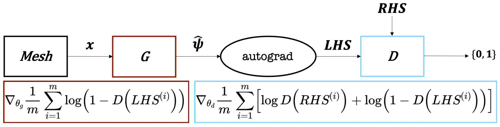

# Welcome to my website!

### On this page:
- [Research](index.md#research) and [applied](index.md#applied) projects
- [Resume](resume/resume.pdf), [GitHub](https://github.com/dylanrandle), and [LinkedIn](https://linkedin.com/in/dylanrandle/)
- My [blog](index.md#blog)

[{:height="50px" width="50px"}](resume/resume.pdf) | [{:height="60px" width="60px"}](https://github.com/dylanrandle) | [{:height="70px" width="70px"}](https://linkedin.com/in/dylanrandle/)

{:height="248px" width="200px"}{:height="248px" width="200px"}

# Projects

## Research
- Unsupervised Generative Adversarial Networks for Differential Equations (in progress)

- Interpretable Reinforcement Learning for Healthcare (in progress)
- [Differentiable Neural Architecture Search](https://towardsdatascience.com/investigating-differentiable-neural-architecture-search-for-scientific-datasets-62899be8714e?source=friends_link&sk=bece331a719b31f24118c4b538b71d4f)

## Applied
- [Deep Generative Modeling](https://github.com/dylanrandle/deepgen)

- [Interpretable Machine Learning](https://github.com/dylanrandle/pynterp)
- [ComputeFest 2020 Workshop: Notebook to Cloud](https://colab.research.google.com/drive/1HUxNsHqqTZ1FRuveu6SS6gr6lCVe6QqO)
- [Twitter Troll Detection](https://dylanrandle.github.io/troll_classification)
- [Automatic Differentiation](https://github.com/dylanrandle/autograd)
- [Modeling Microbiome Dynamics with LSTMs](https://github.com/dylanrandle/microbiome)
- [Tensorflow Training on a Spark Cluster with AWS EMR](https://github.com/dylanrandle/spark-tensorflow)
- [Bayesian GANs: A Paper Review](bayesgan.md)
- [Autonomous Vehicles: A Critical Analysis](safe_avs.md)

## Blog
My [thoughts](blog.md) on various topics.
