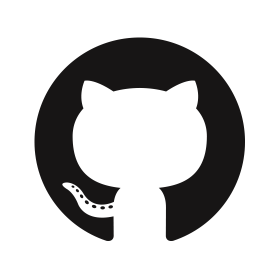
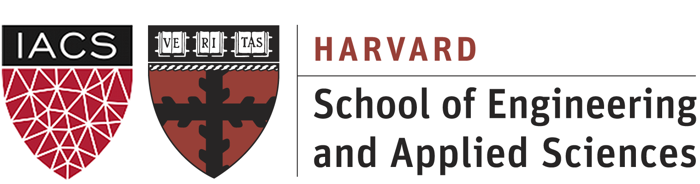
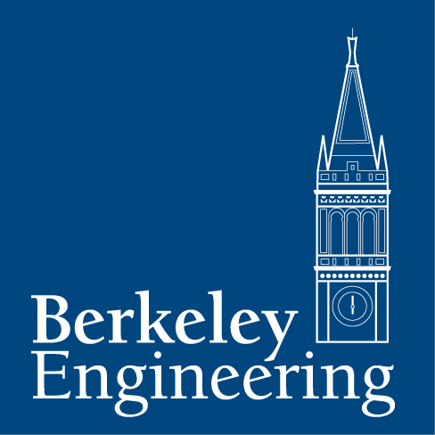

[{:height="50px" width="50px"}](http://dylanrandle.github.io/DylanRandleResume.pdf) | [{:height="50px" width="50px"}](https://github.com/dylanrandle) | [{:height="50px" width="50px"}](https://linkedin.com/in/dylanrandle/)

# Summary

Passionate data scientist interested in understanding complexity and developing new techniques for doing so.

{:height="100px" width="400px"} | {:height="100px" width="100px"}

# Research

- [Neural Nets for Differential Equations](https://dylanrandle.github.io/ac299_website/) ([code](https://github.com/dylanrandle/pde_nn)): I am currently a member of the research group at the Institute of Applied Computational Science (IACS) at Harvard University where
I am investigating ways to use deep learning methods to solve ordinary and partial differential equations

# Projects

- [Twitter Troll Detection](https://dylanrandle.github.io/troll_classification): Project achieving 96% accuracy classifying Twitter trolls using tweets scraped from accounts indicted for meddling in the 2016 U.S. elections
- [Automatic Differentiation](https://github.com/dylanrandle/autograd): Python package implementing automatic
differentiation, supporting both forward and reverse modes
- [Spark Tensorflow](https://github.com/dylanrandle/spark-tensorflow): Training neural networks with Tensorflow
on a Spark/Hadoop-YARN cluster with AWS Elastic Map Reduce
- [Bayesian Generative Adversarial Networks](https://dylanrandle.github.io/bayesgan.html): Paper review, implementation, and
demo of Bayesian GANs

# Personal

In my spare time I love to learn new things, read books, spend time outside, and work on interesting machine learning projects.
