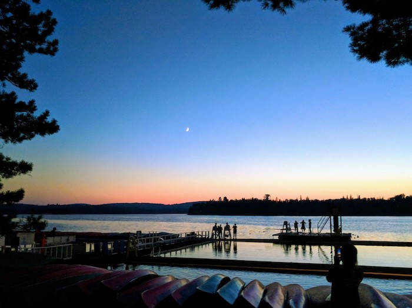

Hello! Welcome to my personal website.

## About

My name is Dylan Randle and I am currently studying for my masters in Data Science at Harvard University, in the School of
Engineering & Applied Sciences. This summer, I will be interning with Amazon Robotics, where I hope to learn about the use
of data science to analyze and predict performance in Amazon's robotics-driven fulfillment centers, at massive scale. I
am also conducting research in physics-aware machine learning methods with applications to turbulence modeling under the
supervision of Pavlos Protopapas and David Sondak.

## Profile

- <a href="http://dylanrandle.github.io/resume.pdf">Resume</a>

- [LinkedIn](https://linkedin.com/in/dylanrandle/)

- [GitHub](https://github.com/dylanrandle)

## Projects

- [Twitter Troll Detection](https://dylanrandle.github.io/troll_classification)

- [Automatic Differentiation](https://github.com/dylanrandle/autograd)

- More in the works!

## Personal

I am an avid guitar player and adventurous outdoorsman; in the future, I may post some interesting guitar and/or
outdoors-related content here! For now, enjoy this stunning sunset picture from one of my favorite places: Camp Ahmek
on Canoe Lake!

