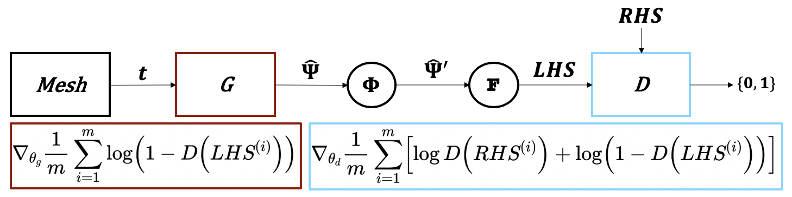
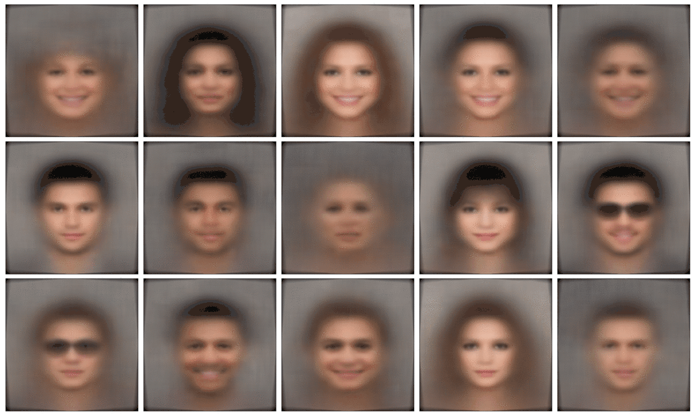

Machine learning scientist with 5+ years experience and a proven track record building and deploying AI systems for **robotics, computer vision, and natural language processing**.

- [Resume](resume/DylanRandleResume.pdf)
- [LinkedIn](https://linkedin.com/in/dylanrandle/)
- [GitHub](https://github.com/dylanrandle)

# Projects

### [Physics-Informed Neural Networks](projects/docs/Harvard_Masters_Thesis_Submit.pdf)

Work conducted for my [thesis](projects/docs/Harvard_Masters_Thesis_Submit.pdf) ([slides](projects/docs/Thesis_Defense_Presentation_Final.pdf), [defense](https://www.youtube.com/watch?feature=player_embedded&v=bq2FurxD2Xo)). Published as a [preprint](projects/docs/GAN_Paper_Preprint.pdf) and ICML workshop [paper](projects/docs/GAN_Paper_AI4Science.pdf).

### [Generating Faces with a Variational Autoencoder](https://github.com/dylanrandle/deepgen)

A fun [project](https://github.com/dylanrandle/deepgen) in which I trained a ResNet VAE to generate faces.

### And more...

- [Interpretable Imitation Learning](projects/docs/IRL_Final_Report.pdf)
- [Differentiable Neural Architecture Search](https://towardsdatascience.com/investigating-differentiable-neural-architecture-search-for-scientific-datasets-62899be8714e?source=friends_link&sk=bece331a719b31f24118c4b538b71d4f)
- [Detecting Trolls on Twitter](https://dylanrandle.github.io/troll_classification)
- [Interpretable Machine Learning Package](https://github.com/dylanrandle/pynterp)
- [Automatic Differentiation from Scratch](https://github.com/dylanrandle/autograd)

<!--
# CUT
- [A Review of Bayesian GANs](projects/bayesgan/bayesgan.html)
- [Workshop on Containerized Cloud Computing](https://colab.research.google.com/drive/1HUxNsHqqTZ1FRuveu6SS6gr6lCVe6QqO)
- [Training Tensorflow Models on a Spark Cluster](https://github.com/dylanrandle/spark-tensorflow)
- [Causal LSTMs for Mouse Microbiome Modeling](https://github.com/dylanrandle/microbiome)
-->
