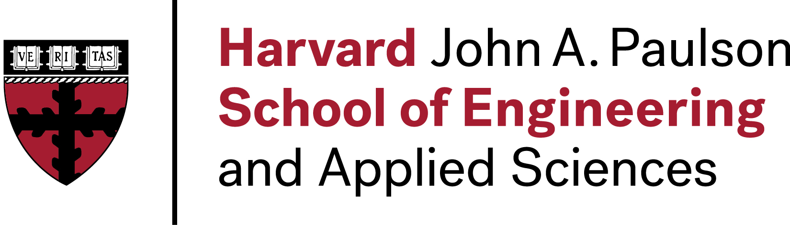

# **Welcome to my website!**

### *Here you will find:*
- Examples of [research](index.md#research) and [applied projects](index.md#applied) I have worked on
- My [resume](resume/resume.pdf) and a brief [background](index.md#background)
- Links to my [GitHub](https://github.com/dylanrandle) and [LinkedIn](https://linkedin.com/in/dylanrandle/) profiles
- An informal [blog](blog.md)

[{:height="50px" width="50px"}](resume/resume.pdf) | [{:height="60px" width="60px"}](https://github.com/dylanrandle) | [{:height="70px" width="70px"}](https://linkedin.com/in/dylanrandle/)

## Background

I grew up in [Toronto, Canada](https://en.wikipedia.org/wiki/Toronto), attending [Upper Canada College](https://www.ucc.on.ca/) for high school, and studying math, physics, and economics. For college, I moved across the continent to [Berkeley, California](https://en.wikipedia.org/wiki/Berkeley,_California) where I had the privilege of studying at [UC Berkeley's College of Engineering](https://engineering.berkeley.edu/), and majored in [Industrial Engineering & Operations Research](https://ieor.berkeley.edu/) (a branch of applied mathematics focusing on business applications).

<!-- ### *Education* -->

{:height="40px" width="275px"} | {:height="50px" width="150px"}

Thereafter, I became the first data scientist at an exciting Toronto startup called [Hubdoc](https://www.hubdoc.com/), where I worked with bright and talented colleagues to design, develop and deploy a client-facing, production deep-learning system for information extraction from financial documents. This system was central to the company's value proposition and [later acquisition](https://www.zdnet.com/article/xero-scoops-up-hubdoc-in-70-million-acquisition/).

<!-- ### *Work Experience* -->

{:height="75px" width="250px"} | {:height="90px" width="200px"}

Realizing that the future of data science and machine learning would be bright, I enrolled in [Harvard's data science program](https://www.seas.harvard.edu/applied-computation/graduate-programs/masters-data-science) to gain a deeper understanding of the field. At Harvard I have relished the chance to work and learn with incredible colleagues and mentors. Over the summer I interned with Amazon Robotics in Boston, MA, and greatly enjoyed the technical and engineering work being done there.

## Researh & Applied Projects

### Research
- Unsupervised Generative Adversarial Networks for Differential Equations (in progress)

- Interpretable Reinforcement Learning for Healthcare (in progress)

### Applied
#### Personal
- [Deep Generative Modeling](https://github.com/dylanrandle/deepgen)

- [Interpretable Machine Learning](https://github.com/dylanrandle/pynterp)

#### Group
- [Differentiable Neural Architecture Search](https://towardsdatascience.com/investigating-differentiable-neural-architecture-search-for-scientific-datasets-62899be8714e?source=friends_link&sk=bece331a719b31f24118c4b538b71d4f)

- [ComputeFest 2020 Workshop: Notebook to Cloud](https://colab.research.google.com/drive/1HUxNsHqqTZ1FRuveu6SS6gr6lCVe6QqO)
- [Twitter Troll Detection](https://dylanrandle.github.io/troll_classification)
- [Automatic Differentiation](https://github.com/dylanrandle/autograd)
- [Modeling Microbiome Dynamics with LSTMs](https://github.com/dylanrandle/microbiome)
- [Tensorflow Training on a Spark Cluster with AWS EMR](https://github.com/dylanrandle/spark-tensorflow)
- [Bayesian GANs: A Paper Review](bayesgan.md)
- [Autonomous Vehicles: A Critical Analysis](safe_avs.md)

## Blog
My [thoughts](blog.md) on various topics.

<!-- ## Awards
Some of the [recognitions](awards.md) I have been fortunate to receive. -->
