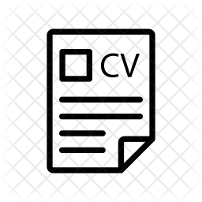
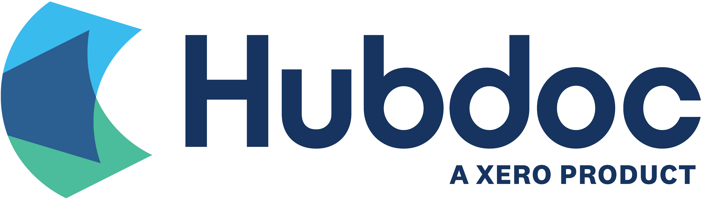

**Welcome to my website.** Here you can find:
- My [resume](resume/resume.pdf), [GitHub](https://github.com/dylanrandle), and [LinkedIn](https://linkedin.com/in/dylanrandle/)
- [Research and applied projects](index.md#projects)
- [A blog](blog.md)

[{:height="50px" width="50px"}](resume/resume.pdf) | [{:height="50px" width="50px"}](https://github.com/dylanrandle) | [{:height="50px" width="50px"}](https://linkedin.com/in/dylanrandle/)

<!-- ## Background -->

<!-- I grew up in Toronto, Canada where I attended Upper Canada College for high school. I graduated with an International Baccalaureate diploma, taking higher-levels in math, physics, and economics. I was an active member of Model United Nations and traveled across North America to compete in debates.

For undergraduate, I enrolled in the College of Engineering at UC Berkeley, where I studied Industrial Engineering & Operations Research and fell in love with mathematical optimization and statistics.

I worked for two years after undergrad at a startup (which was later acquired) as its first data scientist. I designed, developed, and deployed their first machine learning system (a text extraction service using LSTMs) and hired two great engineers to join my team.

Currently I'm studying Data Science at Harvard. -->

<!-- ### Education

{:height="100px" width="250px"} | {:height="100px" width="100px"}

- *MS in Data Science*, Harvard University
- *BS in Industrial Engineering & Operations Research*, UC Berkeley

### Work Experience

{:height="100px" width="175px"} | {:height="60px" width="200px"}

- *Data Scientist*, Amazon
- *First Data Scientist*, Hubdoc (acquired by Xero) -->

## Projects

### Research
- Unsupervised Generative Adversarial Networks for Differential Equations (in progress)
- Interpretable Reinforcement Learning for Healthcare (in progress)

### Personal
- [Deep Generative Modeling](https://github.com/dylanrandle/deepgen)

- [Interpretable Machine Learning](https://github.com/dylanrandle/pynterp)

### Group
- [Differentiable Neural Architecture Search](https://towardsdatascience.com/investigating-differentiable-neural-architecture-search-for-scientific-datasets-62899be8714e?source=friends_link&sk=bece331a719b31f24118c4b538b71d4f)

- [Twitter Troll Detection](https://dylanrandle.github.io/troll_classification)
- [Automatic Differentiation](https://github.com/dylanrandle/autograd)
- [Modeling Microbiome Dynamics with LSTMs](https://github.com/dylanrandle/microbiome)
- [Tensorflow Training on a Spark Cluster with AWS EMR](https://github.com/dylanrandle/spark-tensorflow)
- [Bayesian GANs: A Paper Review](bayesgan.md)
- [Autonomous Vehicles: A Critical Analysis](safe_avs.md)

## Workshops & Presentations
- [ComputeFest 2020: Notebook to Cloud](https://colab.research.google.com/drive/1HUxNsHqqTZ1FRuveu6SS6gr6lCVe6QqO)

## Blog
Some of my [thoughts](blog.md) on various topics.

<!-- ## Awards
Some of the [recognitions](awards.md) I have been fortunate to receive. -->
