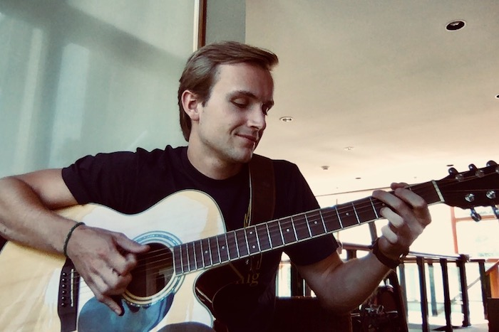

## About

My name is Dylan Labatt Randle and I am currently studying for my masters in Data Science at Harvard University.
Previously I worked as a Data Scientist at Hubdoc. Before that, I studied Industrial Engineering & Operations
Research at UC Berkeley.

<a href="http://dylanrandle.github.io/resume.pdf">Resume</a> | [GitHub](https://github.com/dylanrandle) | [LinkedIn](https://linkedin.com/in/dylanrandle/)

## Research

- Currently researching the use of deep learning in approximating solutions to differential equations. The
hope of this research is that we can use the great approximation power of neural networks to achieve higher-
resolution solutions to differential equations of important scientific and engineering interest (e.g. the
Navier-Stokes equations of fluid flow). Papers, code, and results forthcoming.

## Projects

- [Twitter Troll Detection](https://dylanrandle.github.io/troll_classification): project to identify Twitter
trolls from data collected in relation to a 2016 U.S. indictment of the Russian Internet Research Agency.

- [Automatic Differentiation](https://github.com/dylanrandle/autograd): Python package that performs automatic
differentiation, supporting both forward and reverse modes.

- [Bayesian Generative Adversarial Networks](https://dylanrandle.github.io/bayesgan.html): paper review and
demo of Bayesian GANs.

## Relevant Classes

- At UC Berkeley I focused significantly in the Operations Research field and took classes in statistics,
probability, machine  learning, stochastic processes and optimization.

- At Harvard, my classes have been the following:
  - Fall 2018
    - AM207: Stochastic and Bayesian Methods
    - AC209a: Advanced Introduction to Data Science
    - CS207: Software Development for Data Science
    - AC298R: Discussion seminar on recent research
  - Spring 2019
    - AC209b: Advanced Topics in Data Science
    - CS205: Compute and Data Intensive Programming
    - AC221: Critical Thinking in Data Science
    - AC299R: Supervised research

## Personal

I like to waterski...

watch the sunset...

and play the guitar...

