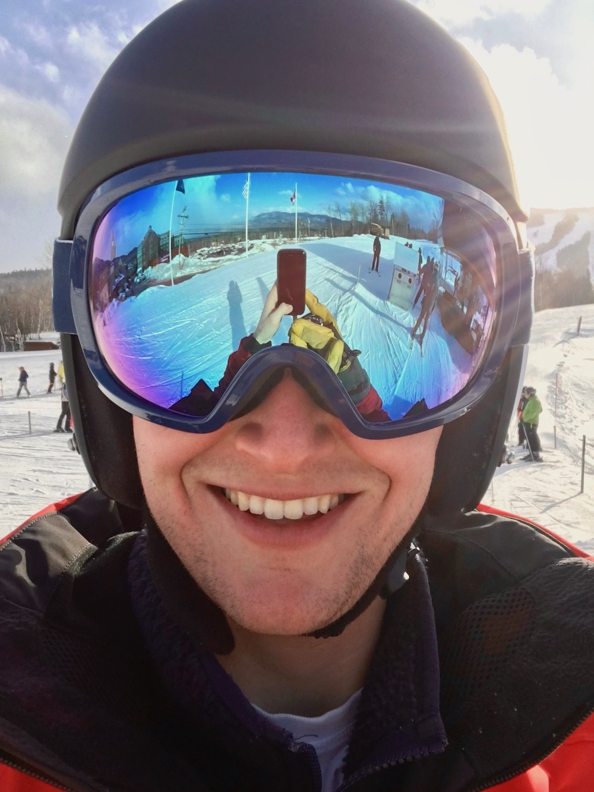
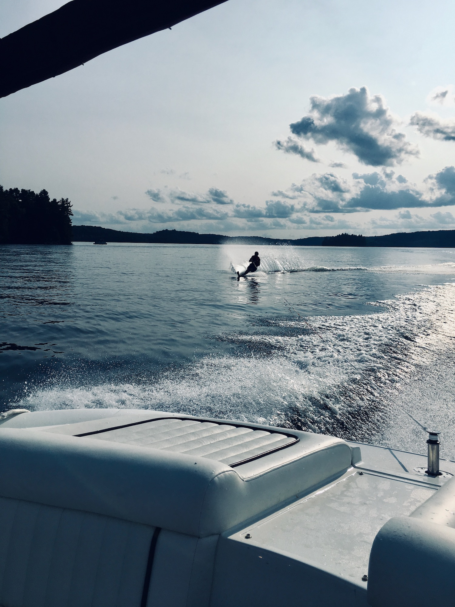

## About

My name is Dylan Labatt Randle and I am currently studying for my masters in Data Science at Harvard University.
Previously I worked as a Data Scientist at Hubdoc. Before that, I studied Industrial Engineering & Operations
Research at UC Berkeley.

<a href="http://dylanrandle.github.io/resume.pdf">Resume</a> | [GitHub](https://github.com/dylanrandle) | [LinkedIn](https://linkedin.com/in/dylanrandle/)

## Projects

- [Twitter Troll Detection](https://dylanrandle.github.io/troll_classification): project to identify Twitter
trolls from data collected in relation to a 2016 U.S. indictment of the Russian Internet Research Agency.

- [Automatic Differentiation](https://github.com/dylanrandle/autograd): Python package that performs automatic
differentiation, supporting both forward and reverse modes.

- [Bayesian Generative Adversarial Networks](https://dylanrandle.github.io/bayesgan.html): paper review and
demo of Bayesian GANs.

## Personal

