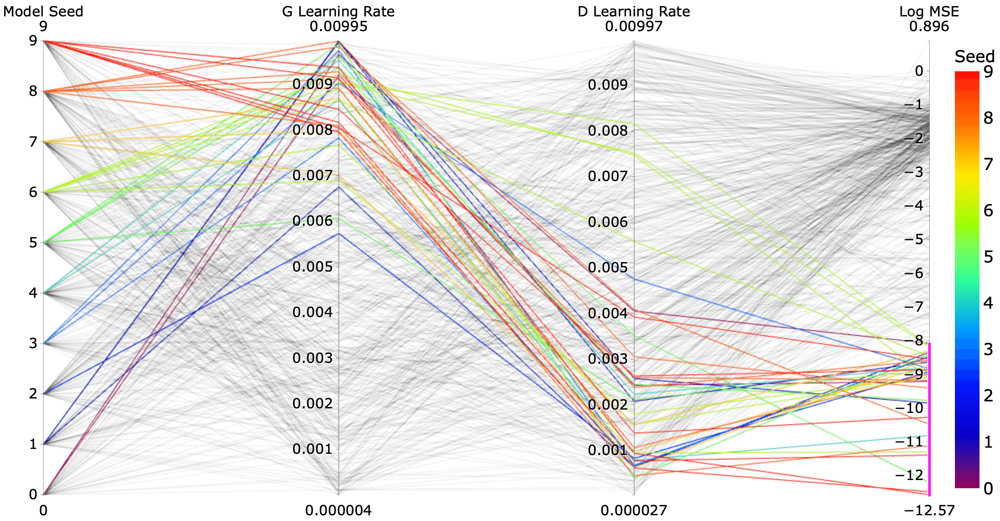
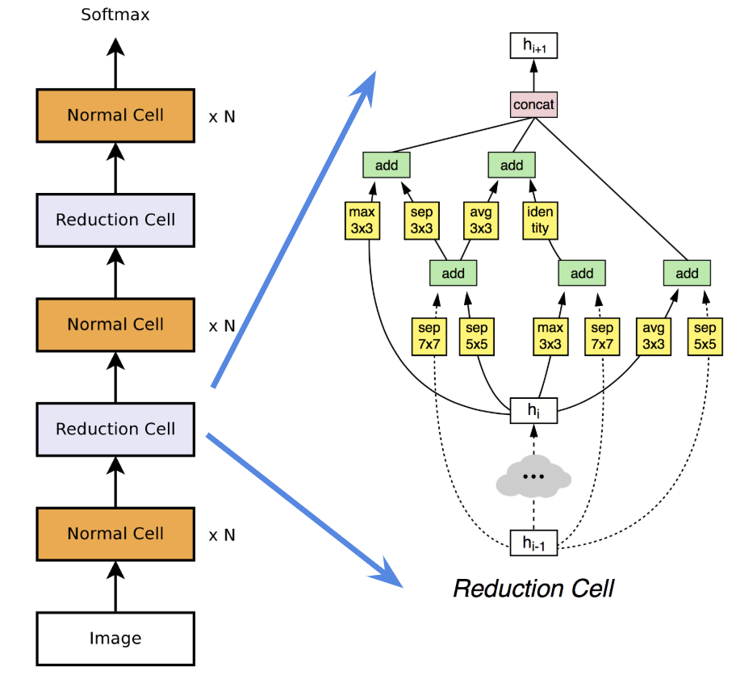
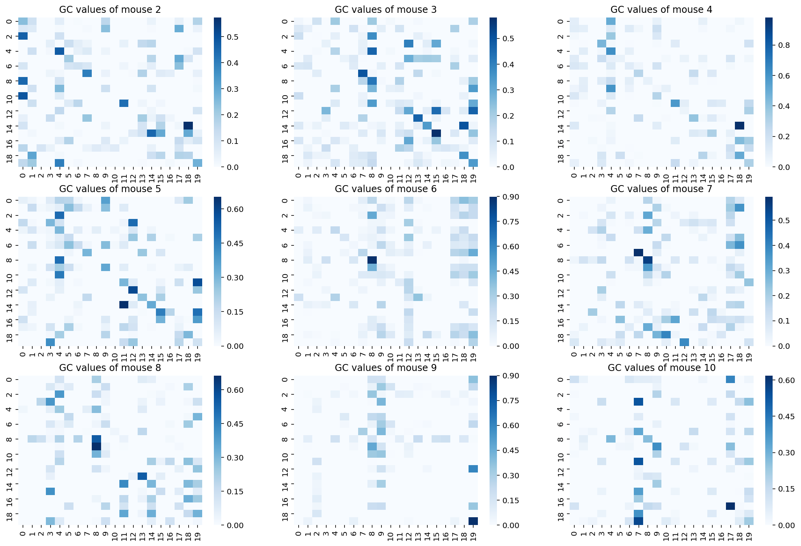

---

#### Analysis of Golf Swings with Computer Vision

- This work is in progress. A link with more details is forthcoming.

---

#### [Unsupervised Learning of Solutions to Differential Equations with Generative Adversarial Networks](denn/deqgan.html)

- This work was part of my [master's thesis](denn/denn.html).

---

#### [Generating Faces with a ResNet VAE](https://github.com/dylanrandle/deepgen)

---

#### [Learning Interpretable Decision Sets for Healthcare with Reinforcement Learning](irl/irl.html)

---

#### [Evaluating Differentiable Neural Architecture Search for Scientific Datasets](https://towardsdatascience.com/investigating-differentiable-neural-architecture-search-for-scientific-datasets-62899be8714e?source=friends_link&sk=bece331a719b31f24118c4b538b71d4f)

---

#### [Causal LSTMs for Mouse Microbiome Modeling](https://github.com/dylanrandle/microbiome)

---

#### [Detecting Trolls on Twitter](https://dylanrandle.github.io/troll_classification)

---

#### [Implementation of Automatic Differentiation](https://github.com/dylanrandle/autograd)

---

#### [Package for Interpretable Machine Learning](https://github.com/dylanrandle/pynterp)

---

#### [Training Tensorflow Models on a Spark Cluster](https://github.com/dylanrandle/spark-tensorflow)

---

#### [A Review of Bayesian GANs](bayesgan/bayesgan.html)

---

#### [A Critical Analysis of AV Companies](safe_avs/safe_avs.html)

---

#### [A Workshop on Containerized Cloud Computing](https://colab.research.google.com/drive/1HUxNsHqqTZ1FRuveu6SS6gr6lCVe6QqO)
