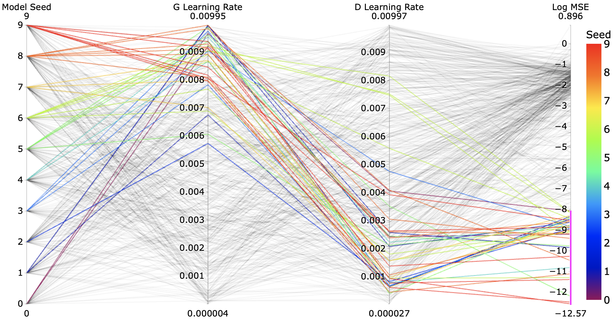
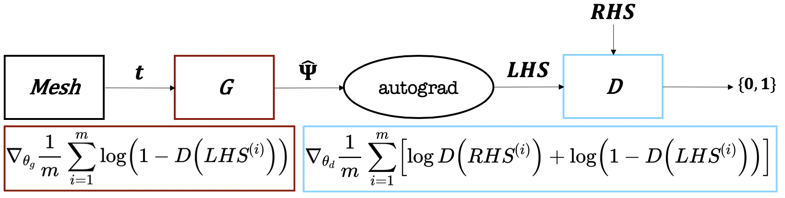
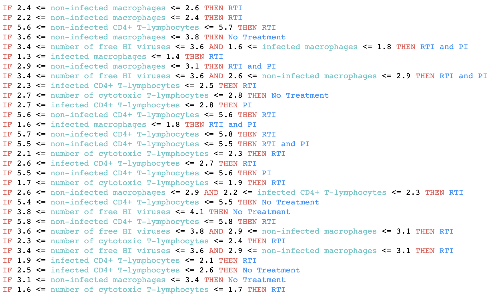
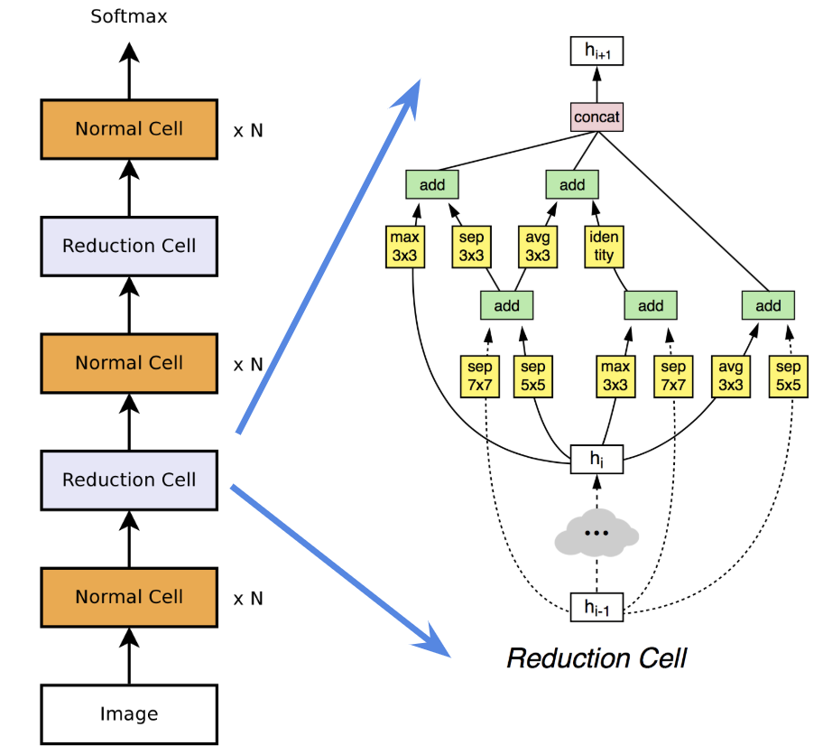

# [Unsupervised Learning of Solutions to Differential Equations with Generative Adversarial Networks](denn/deqgan.html)

# [Master's Thesis: Unsupervised Neural Network Methods for Solving Differential Equations](denn/denn.html)

# [Interpretable Reinforcement Learning for Healthcare with Decision Sets](irl/irl.html)

# [Differentiable Neural Architecture Search for Scientific Datasets](https://towardsdatascience.com/investigating-differentiable-neural-architecture-search-for-scientific-datasets-62899be8714e?source=friends_link&sk=bece331a719b31f24118c4b538b71d4f)

